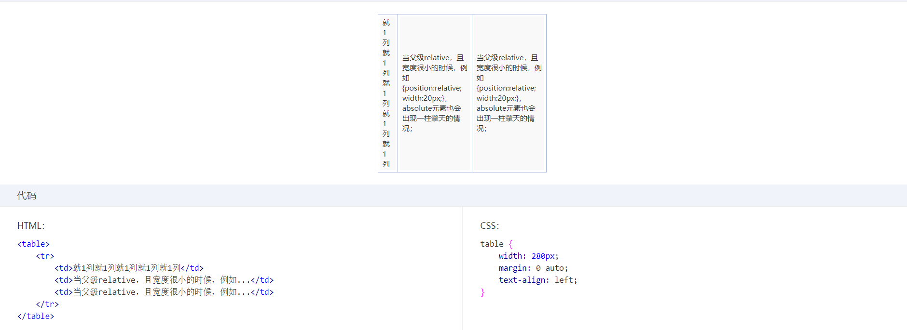
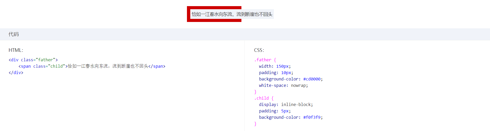

## 一、width:auto的表现形式
 `width:auto`是默认值，所以出镜率并不高，但是它在特定场景下的表现形式却不简单，简单总结了以下四种表现形式

1. *充分利用可用空间*：这个最常见，比如`
`、`
`等元素的默认width是父元素的100%，这些元素的外在盒子都是'block'；
2. *收缩与包裹*：典型代表就是浮动、绝对定位、inline-block元素或者table元素；
3. *收缩到最小*：这个最容易出现在table-layout为auto的表格中

     

>>>当每一列的空间都不够的时候，里面的文字能断则断，默认情况下中文可以随便断，但英文单词和数字不能随便断，于是出现了第一列每个字都断了，在规范中描述这种行为为min-content，那如果所有的列都是不可断的字符或者数字呢？就会出现下面第四种情况，超出容器的限制了（word-break默认的前提下）。

4. *超出容器限制*：除非有明确的width相关的属性设置，否则以上三种情况都不会主动超出父容器的宽度，但存在一种特殊的情况，内容很长的连续英文和数字，或者内联元素被设置`white-space: nowarp`，那么里面的内容则会表现的一江春水向东流的样子，毫不在乎父容器的宽度，这种现象称之为max-content。

    

以上四点就是`width:auto`在不同的场景下的表现形式。

那么，在css盒子中分为‘内部盒子’和‘外部盒子’，同样地，尺寸也分为内部尺寸和外部尺寸。所谓内部尺寸也就是说元素的尺寸由内部元素决定，而外部尺寸也就是元素的尺寸由外部元素决定。

Q：那么以上四种宽度表现形式中，哪些是内部尺寸？哪些是外部尺寸？
A：只有第一种情况是外部尺寸，其余均为内部尺寸。因为只有第一种情况的宽度是依赖父元素来计算的（100%）

## 二、外部尺寸与流体特性

## 三、内部尺寸与流体特性

