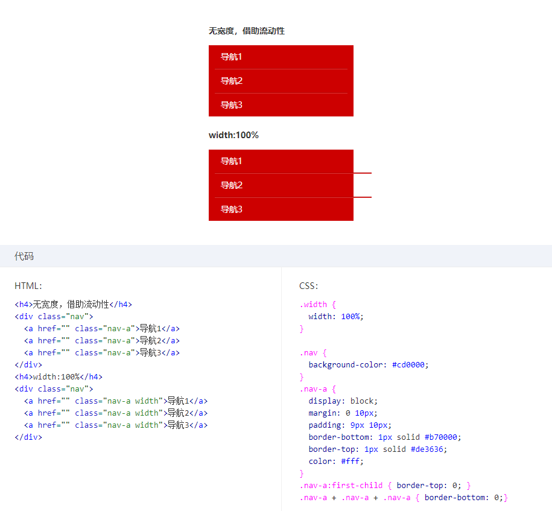

## 一、width:auto的表现形式
 `width:auto`是默认值，所以出镜率并不高，但是它在特定场景下的表现形式却不简单，简单总结了以下四种表现形式

1. *充分利用可用空间*：这个最常见，比如`<div>`、`<p>`等元素的默认width是父元素的100%，这些元素的外在盒子都是'block'；
2. *收缩与包裹*：典型代表就是浮动、绝对定位、inline-block元素或者table元素；
3. *收缩到最小*：这个最容易出现在table-layout为auto的表格中

     

当每一列的空间都不够的时候，里面的文字能断则断，默认情况下中文可以随便断，但英文单词和数字不能随便断，于是出现了第一列每个字都断了，在规范中描述这种行为为min-content，那如果所有的列都是不可断的字符或者数字呢？就会出现下面第四种情况，超出容器的限制了（word-break默认的前提下）。

4. *超出容器限制*：除非有明确的width相关的属性设置，否则以上三种情况都不会主动超出父容器的宽度，但存在一种特殊的情况，内容很长的连续英文和数字，或者内联元素被设置`white-space: nowarp`，那么里面的内容则会表现的一江春水向东流的样子，毫不在乎父容器的宽度，这种现象称之为max-content。

    

以上四点就是`width:auto`在不同的场景下的表现形式。

那么，在css盒子中分为‘内部盒子’和‘外部盒子’，同样地，尺寸也分为内部尺寸和外部尺寸。所谓内部尺寸也就是说元素的尺寸由内部元素决定，而外部尺寸也就是元素的尺寸由外部元素决定。

Q：那么以上四种宽度表现形式中，哪些是内部尺寸？哪些是外部尺寸？
A：只有第一种情况是外部尺寸，其余均为内部尺寸。因为只有第一种情况的宽度是依赖父元素来计算的（100%）

## 二、外部尺寸与流体特性

1. 正常流宽度
  
   当我们往一个容器中倒满水时，水一定会均匀的铺满整个容器，当我们往页面上扔一个`<div>`，其尺寸表现和水一样会铺满整个容器，这就是block容器流的特性。这种特性，在所有的浏览器中都有着一致的表现，那下面的代码就显得没得必要了。
   ```
   a{
       display: block;
       width: 100%;  
   }
   ```
   上面的代码中，使用display使得a块状化没有任何问题，问题是再设置`width:100%`是什么鬼，典型的画蛇添足的表现，这样的设置最致命的一点是破坏了块状元素的流动性，所谓流动性，并不仅仅是宽度为100%这么简单，而是一种margin/border/padding/content的内容区域自动分配水平空间的机制，比如如下例子：
   

   当我们为块级元素设置了width以后，该元素的流动性丢失，我们不得不发挥我们天才般计算能力，通过 ‘容器宽度 - 水平padding - 水平margin - 水平border = ？’来重新计算我们元素的实际宽度，典型的'砌砖头，搭积木'的思维，虽然最终效果都是一样，但健壮性非常差，如果任意一个地方需要加1px，那我们就又要来重新计算width的值，但如果借助块级元素流动性布局，就可以达到敌动我不动的效果，这就是充分利用浏览器原生特性带来的好处，可能有杠精要说了我完全可以设置`box-sizing`来达到并不需要去计算的目的，关于这个属性的实际用途后面的章节再仔细分析。


2. 格式化宽度
    
    这种情况的出现有特定的前置条件：
    - 绝对定位模型中（也就是position的值为absolute或者fixed），并且left/righr或者top/bottom对立方位的属性同时存在。
    - 元素须是`非替换元素`,（替换元素和非替换元素是另外一种元素分类方法，简单说:元素的内容可以被替换的元素就称之为替换元素，如``、`<frame>`等，内容不可替换的自然就叫非替换元素，如`<div>`、`<p>`等，后面会有详细介绍）
    
    当满足以上两种情况，元素的宽度表现为格式化宽度，其计算规则为 相对于最近的具有定位特性（position不为static）的祖先元素计算,啥意思呢？看下面的例子：
    ```
      .father{
        position: relative;
        width: 1000px;
    }
    .children{
        position: absolute;
        left: 100px;
        right: 100px;
    }
    </style>
    <div class="father">
        <div class="children"></div>
    </div>
    ```

    Q：请问div[class='children']元素宽度是多少？

    A：(1000 - 100 -100)px

    是不是对格式化宽度瞬间清楚了，关于格式化宽度远远不止这么简单，后面的position属性会再详细研究。这个平时遇到的较少，可以多多尝试上述的前置条件看看。

## 三、内部尺寸与流体特性

    所谓内部尺寸，也就是元素的尺寸由内部元素决定的，如何判断一个元素使用的是否是内部尺寸呢？ 很简单，如果这个元素里没有任何内容，那该元素的宽度为0，该元素即为内部尺寸。
    内部尺寸主要总结为一下三种表现形式
    
1. 包裹性

    “包裹性”，从字面意思上来看，除了具有包裹的特性，还有自“适应性”， 这里的自适应性指的是元素的尺寸由内部元素决定，但永远小于“包含块”元素的尺寸（除非容器的尺寸小于元素的“最小首选宽度”），因此对于属性`display: inline-block`的元素，即使里面的内容再多，只要是普通文本，宽度也不会超过容器。

    除了上述属性为`display: inline-block`的元素，浮动、绝对定位元素同样具有包裹性

    包裹性的实际开发用处：
     Q：页面某个模块的文字是动态，现在希望文字少的时候居中对齐，文字超过一行的时候居左显示

     ```
     <style>
    .box {
        text-align: center;
        background: #666666;
    }

    .content {
        display: inline-block;
        text-align: left;
        background: rgba(0, 0, 0, .6);
    }
    </style>
    <div class="box">
        <p class="content">
            文字很少文字很少文字很少
        </p>
        <p class="content">
            文字很多文字很多文字很多文字很多文字很多文字很多
        </p>
    </div>
     ```
      
2. 首选最小宽度
    基于上述例子，如果我们设置`.box`的`width`为0，请问`.content`的`width`为多少？

    是0吗？ 当然不是，首先css设计之初就是主要解决图文排版的文字，所以当然不会让图文在`width: auto`时宽度变成0的，此时表现的就是`首选最小宽度`，具体规则如下：
    
    * 东亚文字（如中文），`首选最小宽度`为每个汉字的宽度;

    * 西方文字`首选最小宽度`由特性的一组连续的英文字符单元决定，并不是所有的英文字符都会组成连续单元，一般会终止于空格、短横线、问号以及其他非英文字符，例如'display:inline-block'，被‘-’分割成两个连续的单元，由于连割符‘-’位置在字符后面，所以，最后的宽度为'display:inline-'的宽度， 如果要让西方文字和中文一样，可以尝试`word-break:break-all`属性；

    * 对于图片等类似的替换元素，`首选最小宽度`就是该元素内容本身的宽度。

2. 最大宽度

    最大宽度就是元素可以有的最大宽度， 我的理解是，“最大元素”等同于包裹性元素设置了“white-space: nowrap”后所展示的宽度，如果内部没有块级元素或者块级元素没有设置宽度，则“最大宽度”等同于最大连续内联盒子的宽度


## 三、width值的作用细节

